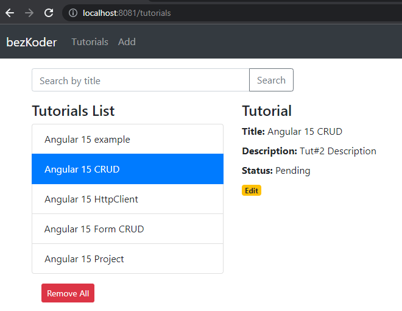

### 🚀 - Functionalities

**1 -** Tutorial has id, title, description, published status

**2 -** Create, retrieve, update, delete Tutorials.

**3 -** There is a search box for finding Tutorials by title.

**4 -** Change status to **Published** using **Publish** button

### 💡  - Start application

The services can be run on the background with command:

```bash
docker-compose up -d
```

Now you can check the current working containers:

```bash
docker ps
```

And Docker images:

```bash
docker image
```

### Angular Client

```powershell
cd angular-15-client
```

Install packages

```powershell
npm install
```

Run [localhost](http://localhost) 

```powershell
ng serve --port 8081
```

after run this commands you can open in browser `http://localhost:8081/`.

| Container | Port |
| --- | --- |
| API | 8080 |
| APP | 8081 |
| MongoDB | 7017 |

## Stop the Application

Stopping all the running containers is also simple with a single command:

`docker-compose down`

```bash
docker-compose down
```

## Step by step

https://www.bezkoder.com/angular-15-node-js-express-mongodb/
